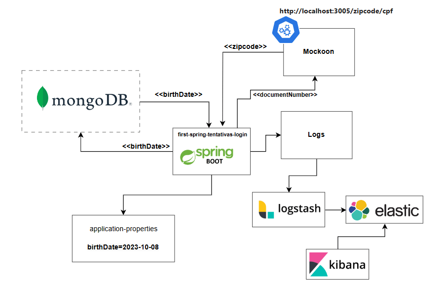

##Projeto Tentativas de Login (Backend)

Contempla uma trava para login incorreto. Caso o usuario tente entrar com a credencial (data de nascimento) incorreta mais de trez vezes (3), o sistema travara o login por 30 segundos para posterior nova tentativa.

####Stack de Tecnologias

* Java 11
* MongoDB
* ELK (Elastic Search,Logstach,Kibana)



###CURL

####Request (Caminho Feliz 200 ok)

```
curl --location 'http://localhost:8080/add' \
--header 'Content-Type: application/json' \
--data '{
"count": 0,
"documentNumber": "00000000001",
"birthDate":"2023-10-08"
}'
```

####Request (Force  400 Bad Request birthDate data errada)
###### Tres(3) tentativas a trava sera ligada

```
curl --location 'http://localhost:8080/add' \
--header 'Content-Type: application/json' \
--data '{
"count": 0,
"documentNumber": "00000000001",
"birthDate":"2023-10-**09**"
}'
```